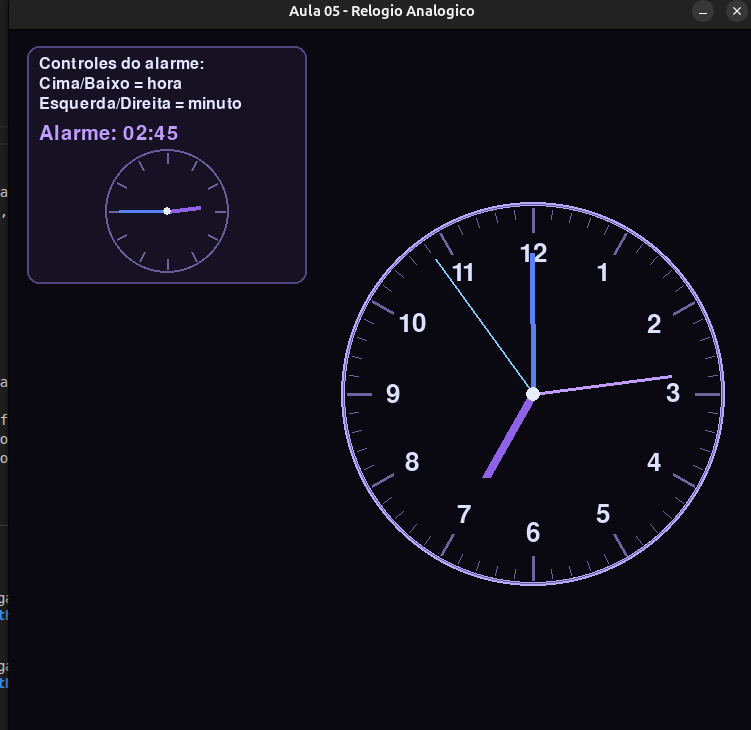

# Relatorio de Implementacao - Aula 05

## Dados da atividade
- Disciplina: Computacao Grafica
- Atividade: Criacao de Relogio Analogico com PyGame
- Autor: Gabriela Zanetti

## 1. Introducao
O objetivo desta atividade foi desenvolver um relogio analogico 2D sincronizado com o horario do sistema, utilizando a biblioteca PyGame. A proposta exigia ponteiros com cores diferentes, anel externo e centralizacao do relogio. Como desafio extra, foi incluido um sistema de alarme ajustavel por teclado.

## 2. Ferramenta escolhida
Foi utilizado PyGame por ser uma biblioteca direta para renderizacao 2D em tempo real. A implementacao foi feita com desenhos de linhas, circulos e texto, atualizados em loop continuo com controle de FPS.

## 3. Implementacao
### 3.1 Estrutura grafica
O relogio principal foi desenhado com:
- anel externo;
- marcacoes de minutos e horas;
- numeros de 1 a 12;
- ponteiros de hora, minuto e segundo.

As cores dos ponteiros foram definidas para facilitar leitura visual:
- horas em tom roxo;
- minutos em azul;
- segundos em azul claro.

### 3.2 Sincronizacao de tempo
A hora atual e obtida via `time.localtime()`. Os angulos dos ponteiros sao calculados por trigonometria:
- segundos: 6 graus por segundo;
- minutos: 6 graus por minuto com ajuste pelos segundos;
- horas: 30 graus por hora com ajuste por minutos e segundos.

### 3.3 Alarme (desafio extra)
Foi implementado um alarme ajustavel por teclado:
- seta para cima/baixo altera hora;
- seta para esquerda/direita altera minuto.

Para melhorar a interface, foi adicionado um painel no canto superior esquerdo contendo:
- instrucoes de controle;
- hora configurada do alarme;
- mini relogio analogico exibindo visualmente o horario do alarme.

## 4. Escolhas de design
Foi adotada uma paleta escura (preto, roxo e azul) para destacar os elementos do mostrador. Tambem foram adicionadas pequenas variacoes de tamanho e proporcao para deixar o visual menos rigido e mais natural. O relogio principal foi redimensionado e reposicionado para nao conflitar com o painel de legenda.

## 5. Resultado
O programa atende aos requisitos principais da atividade e ao desafio extra. O relogio funciona em tempo real, tem boa legibilidade e permite interacao simples para ajuste de alarme.

## 6. Conclusao
A implementacao permitiu aplicar conceitos de computacao grafica 2D, especialmente coordenadas em tela, trigonometria para rotacao e atualizacao por frame. O uso de PyGame se mostrou adequado para a proposta por oferecer simplicidade e controle visual suficiente para o projeto.

## 7. Evidencias para entrega
- Codigo-fonte: `relogio-analogico.py`
- Print da execucao:

